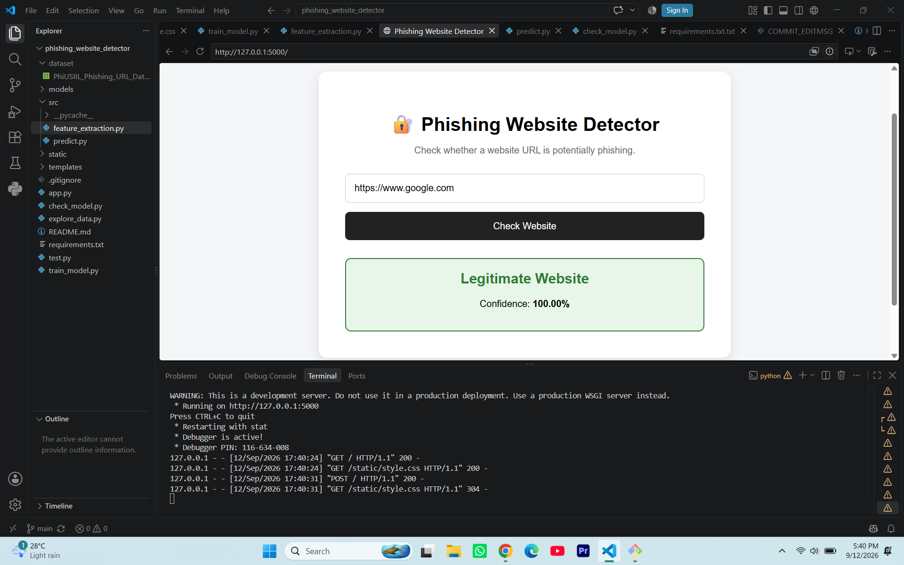

# 🔐 Phishing Website Detector

A machine-learning based web application that analyzes website URLs and predicts whether they are potentially **phishing** or **legitimate**.

## 🌐 Live Demo

🚀 **Try the application:**  
https://phishing-website-detector-xrsq.onrender.com

## 🖥️ Project Preview



## 🚀 Features

- URL-based phishing detection
- Machine Learning classification
- Random Forest Classifier
- Custom URL feature extraction
- Prediction confidence score
- Flask web interface
- URL validation
- Simple and responsive interface

## 🛠️ Technologies Used

- Python
- Pandas
- Scikit-learn
- Random Forest
- Flask
- HTML
- CSS
- Joblib

## 🧠 How It Works

1. User enters a website URL.
2. The application extracts security-related characteristics from the URL.
3. The extracted features are passed to a trained Random Forest model.
4. The model predicts whether the URL is potentially phishing or legitimate.
5. The result and prediction confidence are displayed on the web interface.

## 📊 Machine Learning Model

**Algorithm:** Random Forest Classifier

The model was trained using URL-based features such as:

- URL length
- Domain length
- Path length
- HTTPS usage
- IP address detection
- Subdomain count
- Digit and letter counts
- Special characters
- Suspicious characters
- Suspicious words
- Query length
- URL entropy
- Character ratios

### Model Performance

Accuracy on a random stratified test split:

**99.47%**

> Note: This accuracy is based on a random train/test split of the dataset and should not be interpreted as guaranteed real-world detection accuracy.

## 📂 Project Structure

```text
phishing-website-detector/
│
├── models/
│   └── phishing_model.pkl
│
├── src/
│   ├── feature_extraction.py
│   └── predict.py
│
├── static/
│   └── style.css
│
├── templates/
│   └── index.html
│
├── app.py
├── train_model.py
├── explore_data.py
├── check_model.py
├── requirements.txt
├── README.md
└── .gitignore